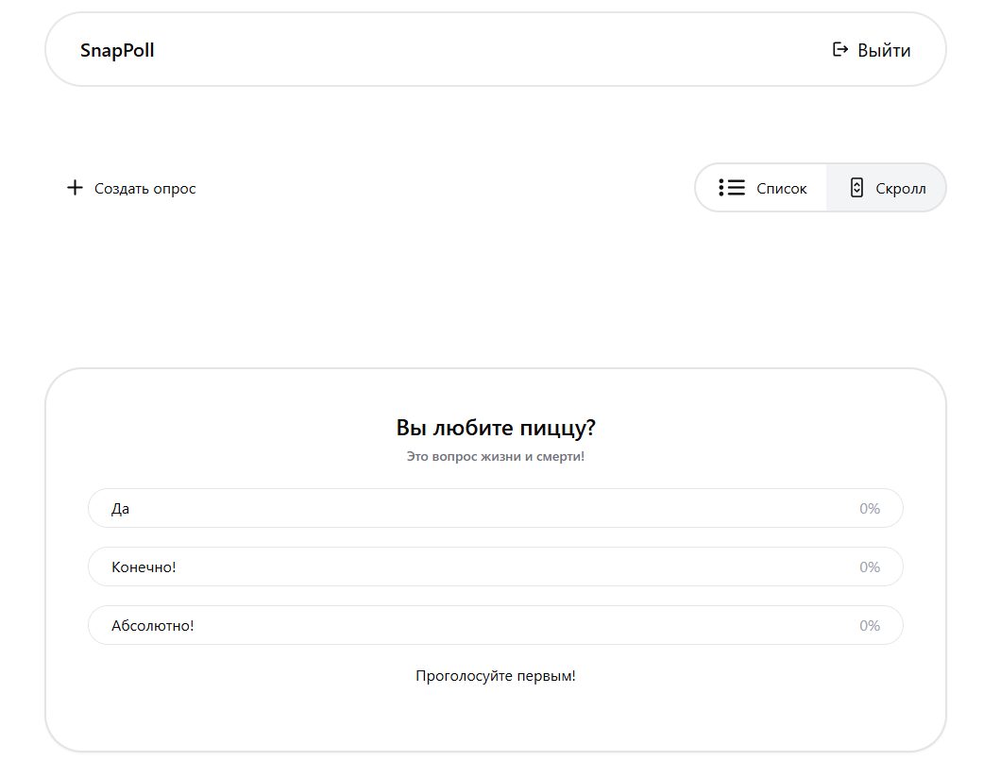

# Сервис Опросов "SnapPoll"

Его предназначение - предоставить пользователям возможность участвовать в опросах. Этот сервис является тестовым заданием

Проект сделан на TypeScrips

## Установка

Для запуска, как для разработчика можно воспользоваться следующими командами. При этом, нужно учитывать, что база данных PostgesSQL уже у вас установлена локально или с помощью Docker и запущена.

Клонируем репозиторий:
```bash
git clone https://github.com/DzeinX/PollsService.git
```
Зайдём в директорию проекта и запустим следующие команды
```bash
cd polls_backend
npm install
npm run start:dev

cd ../polls_frontend
npm install
npm run dev
```
Если вы хотите проверить работоспособность программы, то советую перейти к пункту [Продакшн](#Продакшн)
## Запуск тестов

За тестирования кода отвечает библиотека Jest, как для backend, так и для frontend

Чтобы запустить тесты на frontend react можно использовать эти команды:

```bash
cd polls_frontend
npm run test
```

А для backend аналогичные, меняеются только директории:

```bash
cd polls_backend
npm run test
```

## Продакшн

Для деплоя используется Docker Compose, поэтому установка не займёт много времени и сил. Используйте следующие команды:


Переходим в директорию с докер файлом
```bash
cd docker
```

Запускаем его с помощью команды: Docker автоматически подгрузит все зависимости и запустит проект
```bash
docker-compose up -d
```
Далее я рекомендую использовать следующую команду, чтобы применить миграции к базе данных, развёрнутой в docker. Это нужно для того, чтобы заполнить базовой информацией, такой как пользователи, так как регистрация на сервисе не предусмотрена
```bash
docker-compose run --rm backend bash -c "npm run migration:run"
```
Подключаемся через браузер по ссылке: http://localhost:5173/


## Скриншоты и принцип работы
При запуске вас встретит форма авторизации:


Её поля валидируются и в случае, если какое-либо поле не было заполнено, то под ним появится надпись, что его следует заполнить. Это выглядит примерно так:


А при ошибке авторизации будет жёлтая надпись сверху полей ввода:


Если вы запустили проект через докер и миграциями, то к моменту вашего первого запуска приложения уже будет 2 пользователя:
* test с паролем test
* admin с паролем admin

Как видно из названия: у них разные роли. Админ может создавать, удалять, просматривать и голосовать в опросах, а test может только просматривать и голосовать

Войдём под админом и появимся в панели администрирования (но здесь пока что ничего нет):


Нужно создать новый опрос, тут все поля тоже валидируются (поле "комментарий" можно оставить пустым):


Элементы интерфейса достаточно интуитивны, поэтому не вижу смысла про них рассказывать

Вот что будет после создания опроса:


Мы можем перейти в режим бесконечного скролла: для этого нужно выбрать пункт "Скролл" (кстати, у обычного пользователя нет такой панели, у него есть только режим бесконечного скролла. Это сделано для того чтобы пользователь сфокусировался на быстрых опросах, такая уж идея сайта) 


В этом режиме пролистывая страницу вниз мы будем видеть всё новые и новые опросы (правда, сначала их нужно создать). Ещё важная деталь: как только вы зашли на панель бесконечного скролла то будут подгружены 2 опроса, а потом по мере прокрутки будут подгружаться ещё опросы, но уже по одному

Проголосуем с каждого пользователя и увидим результаты голосования (они динамические, то есть опросы не имеют дату реализации):


Обратите внимание, что повторно голосовать пользователь не может, только один раз

В некоторых браузерах есть баг, по какой-то причине может отображаться, что пользователь проголосовал, но это не так, нужно просто перезагрузить страницу и ошибка уйдёт (для повторения ошибки нужно выйти из одного и войти в другой аккаунт)
